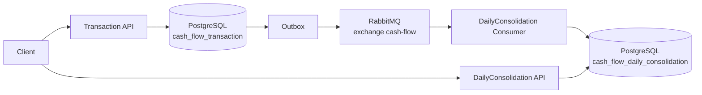

# Cash Flow

Solução para um desafio técnico de Desenvolvedor .NET Sênior focada em gestão de lançamentos financeiros e consolidação diária de saldo.

O sistema foi dividido em dois serviços independentes: um serviço transacional para registrar lançamentos de crédito/débito e um serviço de consolidação diária que consome eventos assíncronos, atualiza o saldo consolidado e permite consulta por data.

## Contexto do desafio

A solução atende a dois fluxos principais:

- Registrar lançamentos financeiros de crédito ou débito.
- Consultar o saldo diário consolidado.

Um requisito importante do desafio é que a aplicação de gestão de lançamentos continue operante mesmo em caso de falha no sistema de consolidação diária. Para isso, a criação de transações não depende de chamada síncrona ao serviço de consolidação. O serviço de transações persiste a operação e grava uma mensagem em Outbox no mesmo banco. A publicação para RabbitMQ ocorre de forma assíncrona.

## Arquitetura

A solução é composta por:

- `CashFlow.Transaction`: serviço responsável por registrar lançamentos financeiros.
- `CashFlow.DailyConsolidation`: serviço responsável por consolidar e consultar saldos diários.
- `CashFlow.Shared.Contracts`: contratos compartilhados, incluindo eventos de integração e Result Pattern.

Cada serviço segue a separação em camadas:

- `Domain`: entidades, enums, invariantes e exceções de domínio.
- `Application`: casos de uso, CQRS, MediatR, validações, contratos de persistência e Result Pattern.
- `Infrastructure`: EF Core, PostgreSQL, RabbitMQ, Outbox, consumer e implementações técnicas.
- `Api`: Minimal APIs, DTOs HTTP, mapeamento de erros e configuração de aplicação.

## Fluxo principal



## Decisões arquiteturais

- **Serviços separados**: `Transaction` e `DailyConsolidation` são independentes e possuem responsabilidades distintas.
- **Bancos independentes**: cada serviço possui seu próprio database PostgreSQL.
- **Consistência eventual**: após criar uma transação, o saldo diário pode demorar alguns instantes para refletir o lançamento.
- **Outbox Pattern**: a transação financeira e a mensagem de integração são persistidas atomicamente no banco transacional.
- **RabbitMQ**: usado para comunicação assíncrona entre os serviços.
- **DLQ**: mensagens inválidas ou com falha de processamento são rejeitadas sem requeue e encaminhadas para dead-letter queue.
- **Idempotência no consumer**: mensagens já processadas são registradas em `processed_messages`.
- **Atualização atômica do saldo**: o saldo diário é atualizado com SQL PostgreSQL usando `ON CONFLICT`, evitando read-modify-write concorrente na aplicação.
- **CQRS + MediatR**: comandos e queries são separados e executados via MediatR.
- **FluentValidation**: valida entradas dos casos de uso.
- **Result Pattern**: falhas funcionais esperadas são representadas como `Result`/`Result<T>`.
- **Minimal APIs**: endpoints HTTP simples, sem Controllers.
- **Tratamento centralizado de exceptions**: erros técnicos inesperados são tratados por `IExceptionHandler`, com resposta pública sanitizada.

## Resiliência entre Transaction e DailyConsolidation

O requisito de manter a gestão de lançamentos operante mesmo com falha na consolidação é atendido pela combinação de banco próprio, Outbox e mensageria assíncrona.

Quando uma transação é criada:

1. O `Transaction` grava a transação e a mensagem de Outbox no PostgreSQL.
2. A API responde sem depender do `DailyConsolidation`.
3. Um background service publica mensagens pendentes da Outbox no RabbitMQ.
4. O `DailyConsolidation` consome a mensagem quando estiver disponível.

Se o serviço de consolidação estiver indisponível, a criação de transações continua funcionando. As mensagens permanecem na Outbox até serem publicadas ou, depois de publicadas, no RabbitMQ até serem consumidas.

## Pico de 50 chamadas/s

A estratégia adotada reduz contenção no caminho síncrono:

- o endpoint de criação grava apenas no banco transacional;
- a consolidação é assíncrona;
- a Outbox processa mensagens em lote de até 100 registros por ciclo;
- o consumer é idempotente;
- a atualização do consolidado usa `INSERT ... ON CONFLICT DO UPDATE`;
- não há read-modify-write concorrente em memória para atualizar saldos.

## Stack

- C#
- .NET 10
- ASP.NET Core Minimal APIs
- Entity Framework Core
- PostgreSQL
- RabbitMQ
- MediatR
- FluentValidation
- xUnit
- FluentAssertions
- NSubstitute
- Docker / Docker Compose

## Pré-requisitos

Execução recomendada:

- Docker Desktop ou Docker Engine com Docker Compose.

Execução manual:

- .NET 10 SDK
- PostgreSQL
- RabbitMQ
- `dotnet-ef`, caso queira aplicar migrations manualmente

## Executando com Docker Compose

Na raiz do repositório:

```bash
docker compose build
docker compose up -d
docker compose ps
```

Para derrubar o ambiente:

```bash
docker compose down
```

Para derrubar e remover o volume do PostgreSQL:

```bash
docker compose down -v
```

### Portas

| Serviço | URL/porta |
| --- | --- |
| Transaction API | `http://localhost:5232` |
| DailyConsolidation API | `http://localhost:5126` |
| PostgreSQL | `localhost:5432` |
| RabbitMQ AMQP | `localhost:5672` |
| RabbitMQ Management | `http://localhost:15672` |

### Credenciais locais

PostgreSQL:

- usuário: `postgres`
- senha: `postgres`

RabbitMQ:

- usuário: `guest`
- senha: `guest`

Essas credenciais são apenas para ambiente local do desafio.

### Databases

O PostgreSQL cria apenas um database por padrão via `POSTGRES_DB`. Por isso, o Compose monta o script `docker/postgres/init-databases.sql` em `/docker-entrypoint-initdb.d`.

Databases criados:

- `cash_flow_transaction`
- `cash_flow_daily_consolidation`

## Migrations

No Docker Compose, as APIs são executadas com:

```text
ApplyMigrations=true
```

Com isso, cada API aplica suas migrations no startup do ambiente local em container. Fora do Docker, migrations não são aplicadas automaticamente por padrão.

Para execução manual, use:

```bash
dotnet ef database update \
  --project src/Transaction/CashFlow.Transaction.Infrastructure/CashFlow.Transaction.Infrastructure.csproj \
  --startup-project src/Transaction/CashFlow.Transaction.Api/CashFlow.Transaction.Api.csproj \
  --context TransactionDbContext
```

```bash
dotnet ef database update \
  --project src/DailyConsolidation/CashFlow.DailyConsolidation.Infrastructure/CashFlow.DailyConsolidation.Infrastructure.csproj \
  --startup-project src/DailyConsolidation/CashFlow.DailyConsolidation.Api/CashFlow.DailyConsolidation.Api.csproj \
  --context DailyConsolidationDbContext
```

## APIs

### Transaction API

#### Criar lançamento financeiro

```http
POST /api/transactions
```

Request:

```json
{
  "amount": 100.50,
  "type": "Credit",
  "occurredOn": "2026-08-21"
}
```

`type` aceita:

- `Credit`
- `Debit`

Response `201 Created`:

```json
{
  "id": "f4b4d2e1-4c64-4d97-9f4d-0bba4f42ec9f"
}
```

### DailyConsolidation API

#### Consultar saldo diário

```http
GET /api/daily-balances/{date}
```

Exemplo:

```http
GET /api/daily-balances/2026-08-21
```

Response `200 OK`:

```json
{
  "date": "2026-08-21",
  "totalCredits": 150.00,
  "totalDebits": 30.00,
  "balance": 120.00
}
```

## Respostas HTTP principais

| Status | Quando ocorre |
| --- | --- |
| `201 Created` | lançamento financeiro criado com sucesso |
| `200 OK` | saldo diário encontrado |
| `400 Bad Request` | entrada inválida ou erro funcional de validação |
| `404 Not Found` | saldo diário inexistente para a data informada |
| `500 Internal Server Error` | erro técnico inesperado |

## Consistência eventual

O endpoint de criação de transação retorna após persistir a transação e a mensagem de Outbox. A publicação no RabbitMQ e a consolidação diária acontecem de forma assíncrona.

Por isso, logo após criar uma transação, a consulta ao saldo diário pode ainda não refletir o lançamento por alguns instantes.

## OpenAPI / Swagger

As APIs registram OpenAPI e Swagger UI em ambiente `Development`.

Com Docker Compose:

- Transaction API Swagger: `http://localhost:5232/swagger`
- Transaction API OpenAPI JSON: `http://localhost:5232/openapi/v1.json`
- DailyConsolidation API Swagger: `http://localhost:5126/swagger`
- DailyConsolidation API OpenAPI JSON: `http://localhost:5126/openapi/v1.json`

Pelos perfis locais em `launchSettings.json`:

- Transaction API HTTP: `http://localhost:5232`
- Transaction API HTTPS: `https://localhost:7085`
- DailyConsolidation API HTTP: `http://localhost:5126`
- DailyConsolidation API HTTPS: `https://localhost:7265`

## RabbitMQ Management

A interface de administração fica em:

```text
http://localhost:15672
```

Credenciais locais:

- usuário: `guest`
- senha: `guest`

Itens úteis para inspeção:

- exchange: `cash-flow`
- fila principal: `cash-flow.daily-consolidation`
- DLQ: `cash-flow.daily-consolidation.dead-letter`
- routing key principal: `financial-transaction-created`
- routing key da DLQ: `financial-transaction-created.dead-letter`

## Testes

Para executar todos os testes:

```bash
dotnet test
```

A solução possui:

- testes unitários de domínio, handlers e validações;
- testes de integração de persistência e fluxo de criação com Outbox.

Os testes de integração atuais usam PostgreSQL real em `localhost:5432` com usuário/senha `postgres/postgres`. Eles não usam Testcontainers.

## Estrutura de diretórios

```text
.
├── docker/
│   └── postgres/
│       └── init-databases.sql
├── src/
│   ├── CashFlow.Shared.Contracts/
│   ├── Transaction/
│   │   ├── CashFlow.Transaction.Api/
│   │   ├── CashFlow.Transaction.Application/
│   │   ├── CashFlow.Transaction.Domain/
│   │   └── CashFlow.Transaction.Infrastructure/
│   └── DailyConsolidation/
│       ├── CashFlow.DailyConsolidation.Api/
│       ├── CashFlow.DailyConsolidation.Application/
│       └── CashFlow.DailyConsolidation.Infrastructure/
├── tests/
│   ├── CashFlow.Transaction.UnitTests/
│   ├── CashFlow.Transaction.IntegrationTests/
│   ├── CashFlow.DailyConsolidation.UnitTests/
│   └── CashFlow.DailyConsolidation.IntegrationTests/
├── docker-compose.yml
├── Directory.Build.props
├── Directory.Packages.props
├── global.json
└── CashFlow.slnx
```

## Trade-offs e limitações atuais

- A DLQ não possui retry transitório automático com backoff antes do dead-letter.
- O processamento da Outbox usa polling em intervalo fixo de 5 segundos.
- As migrations automáticas só são executadas quando `ApplyMigrations=true`.
- As credenciais do Compose são simples e voltadas apenas para ambiente local.
- Os testes de integração dependem de PostgreSQL real local.
- Não há política de limpeza/retention para `outbox_messages` e `processed_messages`.

## Melhorias futuras

- Retry transitório com backoff antes da DLQ.
- Testcontainers para testes de integração totalmente isolados.
- Observabilidade distribuída com OpenTelemetry e integração com ferramentas como Dynatrace.
- CI/CD.
- Kubernetes/GKE.
- Secrets manager e configuração segura.
- Métricas específicas para Outbox, consumer lag e DLQ.
- Testes de carga.
- Estratégia de limpeza/retention para Outbox e `processed_messages`.
